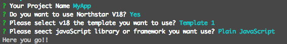

# ibmui 




## What's ibmui?

ibmui helps you to kickstart new projects using ibm framework & other latest available tools. It will guide you to maintain a pattern or coding standard which is same across the ibm.

To do so, we provide a generator ecosystem. A generator is basically a plugin that can be run with the `ibmui` command to scaffold complete projects or useful parts.


## Usage

```sh
# install ibmui generator
npm install --global ibmui

# run it
ibmui
```

## Troubleshooting

If `ibmui` doesn't work, then check opened issues for a similar problem. Open a new issue if your problem haven't been reported yet. Make sure to always include the version of `ibmui` (`ibmui --version`) and Node.js (`node --version`) you use.


## Contribute

Send an email to me [sanjitbauli@in.ibm.com](mailto:sanjitbauli@in.ibm.com).


## Changelog

See the [release page](https://github.com/sanjitbaulibm/ibmui/releases).


## Contributers

  <a href="https://github.com/sanjitbauliibm" target="_blank">
    
  </a>


## License

IBM Digital Service Group © IBM
